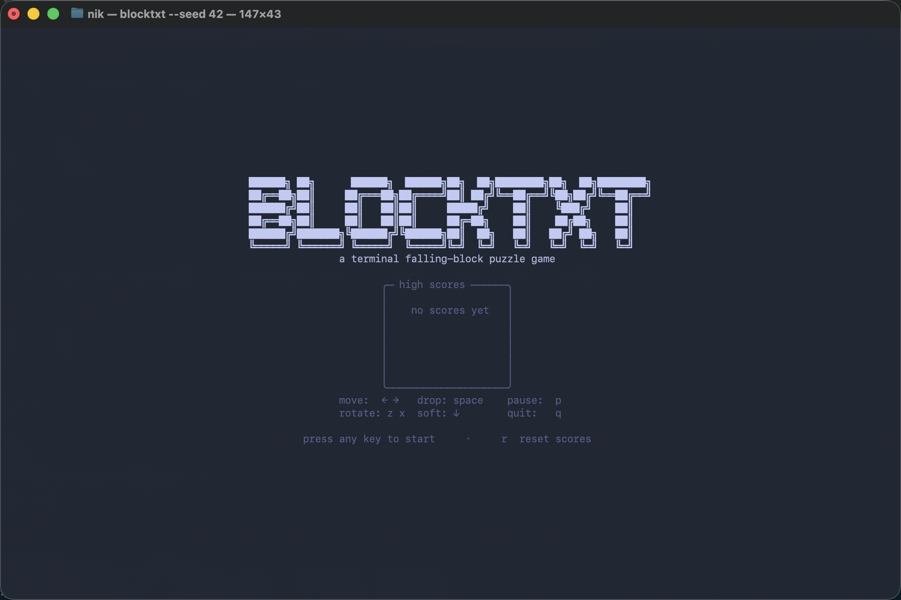
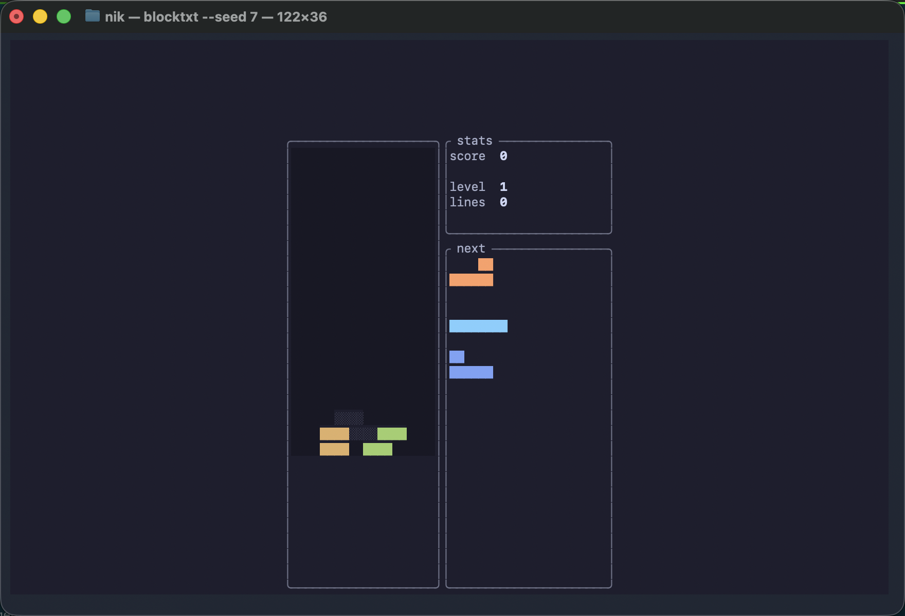

# v0.1.0 → v0.1.1 polish — visual comparison

v0.1.0 shipped a functionally correct but visually cramped TUI. v0.1.1
re-designs the rendering with:

- **Tokyo Night palette** (higher saturation than Catppuccin Mocha).
- **ASCII title screen** with top-5 leaderboard and key-to-start.
- **Juice animations**: spawn fade-in, line-clear flash pop, score rollup, game-over zoom-in.
- **Double-wide cells** with solid `██` blocks (not `[]` brackets).
- **Rounded Unicode borders** throughout.
- **Modern HUD**: lowercase labels, thousand-separator scoring, real piece shapes in next queue.
- **Rebranded** binary + repo + CLI with zero trademark references.

## Evidence

### Before (v0.1.0)

The v0.1.0 before-state is documented in issue #50 (linked GIF on branch
`qa/v010-evidence`): bare `[]` brackets, no playfield border, harsh primary
colors, single-char-wide cells, no title screen.

### After (v0.1.1)




Animated captures (asciinema → agg):


## Measured improvements

| | v0.1.0 | v0.1.1 |
|---|---|---|
| Playfield border | absent | rounded Unicode |
| Cell glyph | `[]` brackets | `██` solid blocks |
| Palette | harsh primary | Tokyo Night |
| Title screen | none | ASCII logo + leaderboard + controls |
| Game Over overlay | basic box | modal w/ NEW BEST! highlight + zoom-in |
| Pause overlay | basic box | modal |
| Score display | instant jump | 250 ms rollup |
| Animations | only line-clear | spawn fade, flash pop, rollup, zoom |
| Themes | 1 (Catppuccin) | 2 (Tokyo Night default + Catppuccin) |
| Test count | 147 | 193+ |

## How to verify yourself

```bash
cargo install --locked --git https://github.com/NikolayS/blocktxt-1 --tag v0.1.1
blocktxt --seed 42
# Press any key to start.
```

Or for the Catppuccin palette: `blocktxt --theme catppuccin-mocha --seed 42`.
